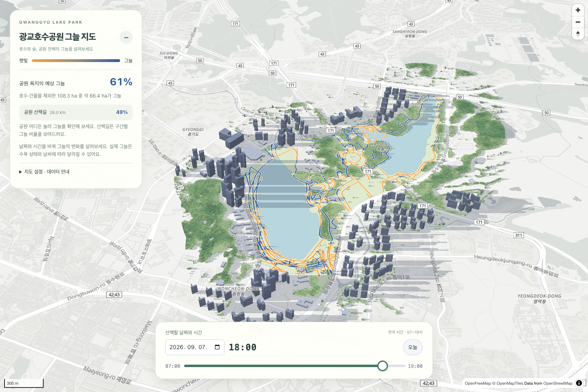
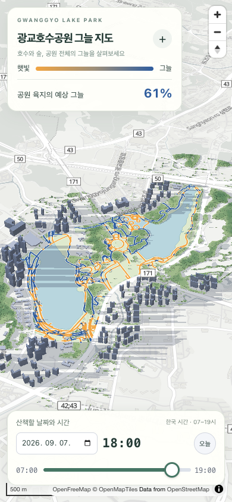

# Gwanggyo Lake Park Shade Map

**광교호수공원 그늘 지도** — 산책할 날짜와 시간을 골라, 햇빛을 피할 수 있는 그늘을 살펴보세요.

건물과 수목이 만드는 그림자를 지도에 표시하고, 공원 육지의 예상 그늘 면적과 산책길 구간별 그늘 비율을 계산합니다.

모바일 화면 보기

  

## 주요 기능

- **날짜·시간별 그늘** — 한국 시간 07:00–19:00, 5분 간격으로 그림자와 그늘 비율 갱신
- **산책길 그늘 지도** — 구간별 햇빛·그늘 비율을 색으로 표시하고 클릭하면 상세 정보 제공
- **공원 전체 분석** — 호수와 건물을 제외한 공원 육지의 예상 그늘 면적 계산
- **입체 지도와 레이어 설정** — 건물·수목 높이, 위성 수관, 그림자, 산책길 표시 조절
- **링크 공유와 모바일 지원** — 선택한 조건과 지도 위치를 공유하고 작은 화면에서도 편리하게 이용

## 데이터 출처

| 출처 | 사용 범위 | 출처·이용 조건 |
| --- | --- | --- |
| OpenStreetMap contributors | 공원, 산책길, 건물, 수목·시설 | [OpenStreetMap / ODbL](https://www.openstreetmap.org/copyright) |
| Meta · World Resources Institute | 위성 추정 수관 높이 (2019년 2월 영상) | [Canopy Height Maps v2 / CC BY 4.0](https://registry.opendata.aws/dataforgood-fb-forestsv2/) |
| Copernicus Sentinel-2 (ESA) | 상록·낙엽 비율과 계절별 잎 변화 추정 | Contains modified Copernicus Sentinel data 2023–2025 — [Copernicus 데이터 이용 조건](https://sentinels.copernicus.eu/documents/247904/690755/Sentinel_Data_Legal_Notice) |
| OpenFreeMap · OpenMapTiles | 배경 지도 타일과 스타일 | [OpenFreeMap](https://openfreemap.org/), [OpenMapTiles](https://openmaptiles.org/) — 지도 내 출처 표기 유지 |

이 지도는 **추정 도구**입니다. 실제 그늘은 날씨, 지형, 건물·수목의 형태와 데이터 시점에 따라 달라집니다. 일부 건물 높이는 추정값이며, 수목은 2019년 2월 위성 영상에서 추정한 수관 높이를 사용하고, 계절에 따라 잎이 진 낙엽수는 옅은 그늘로 계산합니다. 공원 분석 영역이 실제 통행 가능 구역을 뜻하지는 않습니다.

자세한 데이터와 계산 기준은 [데이터와 계산 방법](docs/data-and-methods.md)에 설명되어 있습니다.

## 기여하기

버그 제보, 사용성 개선, 계산 검증, 데이터 보강과 문서 개선을 환영합니다.

## 라이선스

코드는 [MIT License](LICENSE)로 배포됩니다. 데이터와 배경 지도에는 위 출처별 이용 조건이 적용됩니다.
